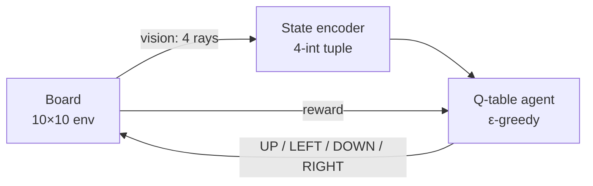

# Learn2Slither — Q-learning Snake agent

A reinforcement-learning agent that learns to play Snake from scratch, using tabular Q-learning and a deliberately limited view of the world: the snake only sees the first object in each of the four directions from its head.

## How it works



- **Environment** (`snake_rl/env/board.py`): 10×10 grid, 2 green apples (grow), 1 red apple (shrink), snake starts at length 3. `step()` follows the familiar `(state, reward, done, info)` RL contract.
- **State encoder** (`snake_rl/agent/vision.py`): compresses what the snake sees into a hashable tuple such as `(WALL, EMPTY, GREEN, BODY)`. That gives a small, discrete state space a Q-table can actually learn.
- **Agent** (`snake_rl/agent/q_table.py`): ε-greedy Q-learning (α = 0.1, γ = 0.95, ε decays 1.0 → 0.05). Models save to and load from JSON so they're easy to inspect.
- **Rewards:** green apple +1, red apple −1, death −5, each step −0.05 (time pressure), +2 bonus for reaching length 10.
- **UI** (`snake_rl/ui/renderer.py`): optional pygame renderer with a step-by-step mode for watching the policy decide.

## Run it

```bash
git clone https://github.com/Alcheemiist/learn2slither.git
cd learn2slither
python -m venv .venv && source .venv/bin/activate
pip install -e ".[dev]"

# Train 100 sessions headless and save the model
python -m snake_rl.trainer.run --sessions 100 --save models/100.json --visual off

# Watch the trained model play, learning off, one step at a time
python -m snake_rl.trainer.run --load models/100.json --sessions 10 --dontlearn --visual on --step

# Tests
pytest
```

## Project structure

```
snake_rl/
├── env/board.py       # game rules, rewards, vision rays
├── agent/vision.py    # vision → discrete state
├── agent/q_table.py   # ε-greedy Q-learning + JSON persistence
├── trainer/run.py     # training / evaluation CLI
└── ui/renderer.py     # pygame visualisation
tests/                 # unit tests
```

## Results

After 1,000 training sessions, the greedy policy (no exploration) was evaluated on 100 fresh boards. It reached a **mean length of 5** (starting length 3) and a **best of 27**.

## Design notes

- **Restricted observation by design.** The agent never sees the full grid, so the challenge is designing a state representation small enough to learn yet rich enough to survive.
- **Tabular over deep RL.** With a 4-direction × 5-object vision, the state space is tiny (5⁴ = 625 states). A Q-table trains in seconds and stays fully inspectable. Richer vision (e.g. distance along each ray) is the obvious next lever for longer snakes.

---

Built by [Elmahdi Elaazmi](https://elaazmielmahdi.com) as part of the 1337 / 42 Network AI & ML curriculum.
